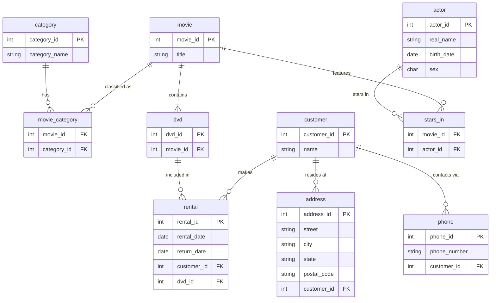

# DB-Project

## Overview

This project is a part of the "Banco de Dados 1" course from the Computer Science program at IFB. It involves designing and implementing a relational database for managing a DVD rental system. The database schema includes tables for movies, categories, actors, customers, addresses, phones, rentals, and their interrelationships.

## Schema

### Conceptual Schema

The conceptual schema provides a high-level overview of the database design. You can view the detailed conceptual schema in the file:

- [schema-conceptual.pdf](schema-conceptual.pdf)

### Logical Schema

The logical schema defines the structure of the database, including tables, columns, and relationships. You can view the detailed logical schema in the file:

- [schema-logical.pdf](schema-logical.pdf)

### Entity-Relationship Diagram

The following Mermaid diagram represents the entities and their relationships in the database:



## Implementation

The SQL schema used to implement the database is available in the file:

- [schema.sql](schema.sql)

This file contains the SQL commands to create the tables and define the relationships as described in the logical schema.

## Sample Data

Sample data for populating the database is provided in the file:

- [sample.sql](sample.sql)

This file includes SQL commands to insert initial data into the database tables.

## Scripts

Additional SQL scripts used for various operations are provided in the file:

- [script.sql](script.sql)

This file includes scripts for common database operations and queries.

## Getting Started

1. **Clone the repository:**

   ```bash
   git clone https://github.com/gabrielcesar-dev/bd1-project.git
   cd your-repo-name
   ```

2. **Set up the database:**
   - Use the `schema.sql` file to create the database schema.
   - Load sample data using the `sample.sql` file.

3. **Run SQL scripts:**
   - Execute `script.sql` for any additional operations or queries.

## Contributing

Contributions are welcome! If you have suggestions or improvements, please fork the repository and submit a pull request.
